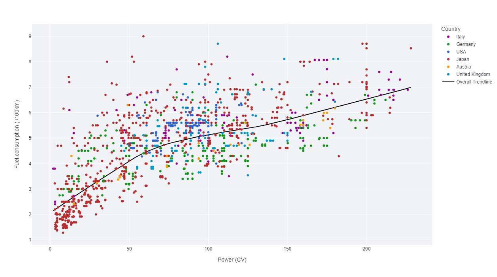
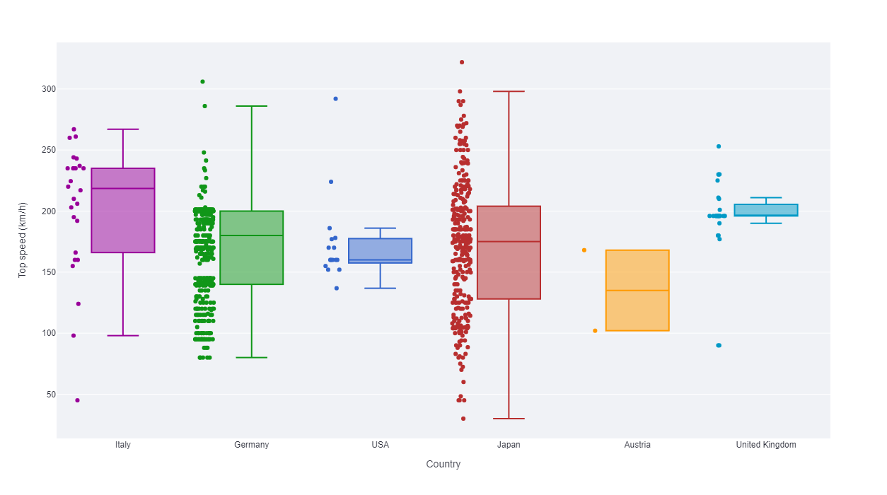
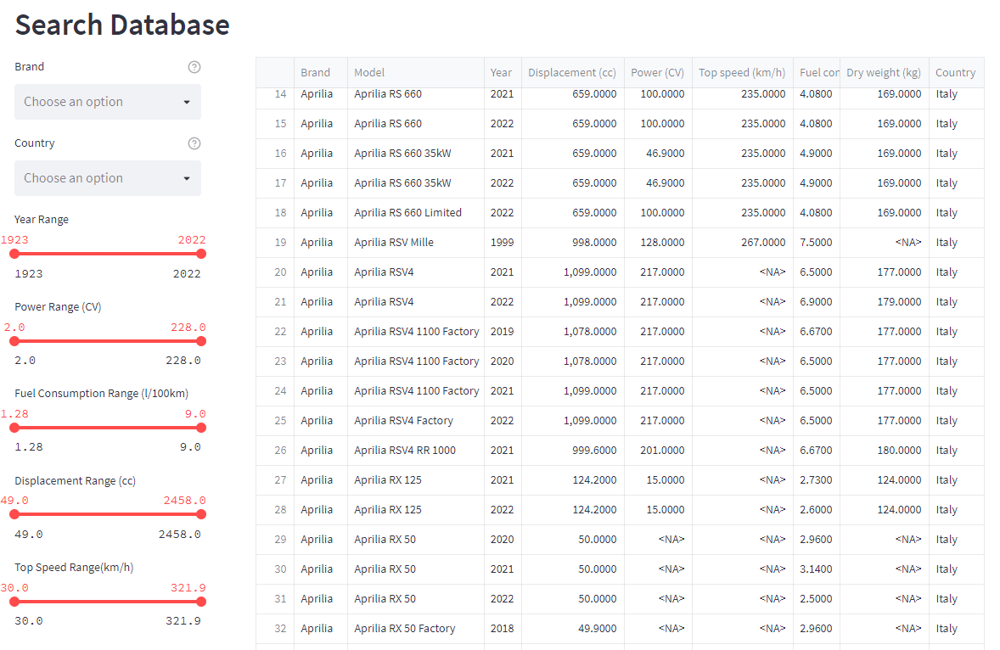

# st_motorcycle
A repository with a streamlit app about motorcycles.

The dataset is sourced from https://www.kaggle.com/datasets/emmanuelfwerr/motorcycle-technical-specifications-19702022

This project has 3 main dependencies: Streamlit, Pandas, and Plotly.

Install the required pachages using:

    python -m pip install -r requirements.txt

 

## Usage
 

To Start this project in your localhost type on a console while on the project folder:

    streamlit run main.py

It has 2 graph types: 
### Scatter

 

### Boxplot

 
You can select which parameters to plot with the input widgets to the left of the graph.

 
Below the graph you can query the database with the filters provided.

